# OLED Canvas Studio

**OLED Canvas Studio** is a browser-based visual editor for designing monochrome (1-bit) embedded display interfaces and generating ready-to-flash [U8g2](https://github.com/olikraus/u8g2) Arduino code — no installation or back-end required.

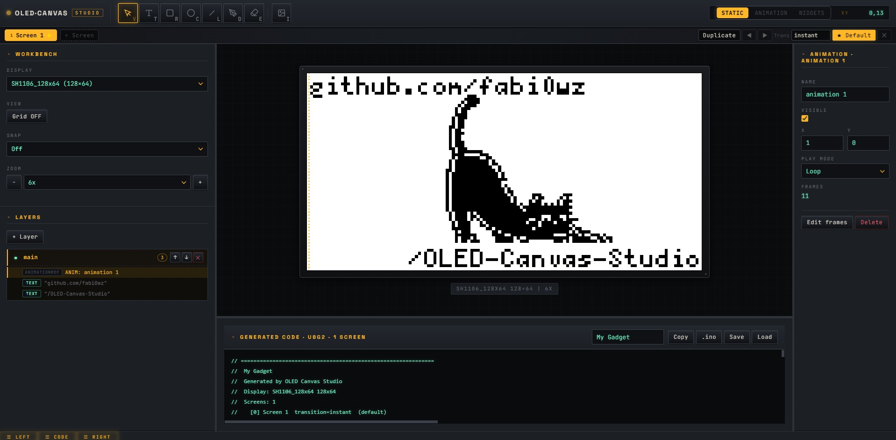

---

## Table of Contents

- [OLED Canvas Studio](#oled-canvas-studio)
  - [Table of Contents](#table-of-contents)
  - [What Is It?](#what-is-it)
  - [Features](#features)
  - [Getting Started](#getting-started)
    - [Prerequisites](#prerequisites)
    - [Install and run](#install-and-run)
    - [Build for production](#build-for-production)
  - [User Interface](#user-interface)
    - [Top Toolbar](#top-toolbar)
    - [Scene Modes](#scene-modes)
    - [Multi-Screen Manager](#multi-screen-manager)
    - [Workbench Panel](#workbench-panel)
    - [Canvas](#canvas)
    - [Layers Panel](#layers-panel)
    - [Properties Panel](#properties-panel)
    - [Code Panel](#code-panel)
  - [Drawing Tools](#drawing-tools)
    - [Select (`V`)](#select-v)
    - [Text (`T`)](#text-t)
    - [Rectangle (`R`)](#rectangle-r)
    - [Circle (`C`)](#circle-c)
    - [Line (`L`)](#line-l)
    - [Freehand Draw (`D`)](#freehand-draw-d)
    - [Eraser (`E`)](#eraser-e)
    - [Import Bitmap (`I`)](#import-bitmap-i)
  - [Frame-by-Frame Animations](#frame-by-frame-animations)
  - [Procedural Widgets](#procedural-widgets)
  - [Screen Transitions](#screen-transitions)
  - [Fonts](#fonts)
  - [Subtract (Inverted) Mode](#subtract-inverted-mode)
  - [Layers](#layers)
  - [Display Presets](#display-presets)
  - [Project Save / Load](#project-save--load)
  - [Tech Stack](#tech-stack)
  - [License](#license)

---

## What Is It?

OLED Canvas Studio solves the common pain of trying to lay out a monochrome OLED display interface by trial-and-error on a physical microcontroller. Instead, you:

1. Pick your OLED display model (SSD1306, SH1106, etc.)
2. Drag shapes, text, and freehand pixels onto a pixel-perfect canvas
3. Copy the generated U8g2 C++ code and paste it directly into your Arduino sketch

The canvas renders exactly what will appear on the real display — every pixel, every font glyph matches the U8g2 library output.

---

## Features

| Feature | Description |
|---|---|
| **8 drawing tools** | Select, Text, Rectangle, Circle, Line, Freehand draw, Eraser, Bitmap import |
| **6 pixel-accurate U8g2 fonts** | 5×7, 6×10, 7×13, 8×13, 9×15, 10×20 — rendered from official BDF files |
| **Multi-screen projects** | Design multiple independent screens and navigate between them at runtime |
| **Screen transitions** | 8 animated transition effects when switching screens (slide, wipe, fade) |
| **Frame-by-frame animations** | Sprite-style animations with configurable per-frame duration and playback modes (loop, once, ping-pong) |
| **Onion-skin preview** | See adjacent animation frames as a translucent overlay while editing |
| **6 procedural widgets** | Analog Clock, Digital Clock, Progress Bar, Meter, Gauge, Battery — with live data binding |
| **Subtract (inverted) mode** | Any shape can erase pixels instead of drawing them, for masking / cutout effects |
| **Layer system** | Multiple named layers with per-layer visibility toggle and element reordering |
| **Adjustable zoom** | 1× to 20× zoom with grid overlay option |
| **Snap-to-grid** | Optional pixel snapping at 1, 2, 4, 8, or 16 px increments |
| **Transform tools** | Flip H/V, rotate ±90°/180° for rectangles and circles |
| **Resizable panels** | All three side panels and the code panel are drag-resizable and collapsible |
| **U8g2 code generation** | One-click copy / save as `.ino` of complete Arduino sketch with screen navigation API |
| **Project save / load** | Save project as `.json`, reload later — backward-compatible with single-screen projects |
| **Live data placeholders** | Use `{var}` in text to mark runtime variable positions |
| **8 display presets** | SSD1306 128×64, 128×32, 64×48, 72×40 · SH1106/SSD1309/SH1107 variants |

---

## Getting Started

### Prerequisites

- [Node.js](https://nodejs.org/) ≥ 18

### Install and run

```bash
# Clone the repo
git clone https://github.com/fabi0wz/OLED-Canvas-Studio.git
cd OLED-Canvas-Studio

# Install dependencies
npm install

# Start the dev server
npm run dev
```

Open **http://localhost:5173** in your browser.

### Build for production

```bash
npm run build
# Output in dist/
```

---

## User Interface

### Top Toolbar

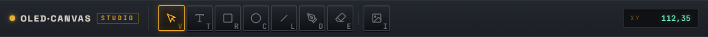

The top bar contains:

| Element | Description |
|---|---|
| **Logo** | OLED·CANVAS STUDIO branding |
| **Tool buttons** | One button per drawing tool (keyboard shortcuts shown below each icon) |
| **Scene mode tabs** | Switch between **static**, **animation**, and **widgets** editing modes |
| **Playback controls** | Play/pause, previous/next frame, frame counter (visible in animation mode) |
| **XY coordinates** | Live mouse position in display pixel coordinates |

**Keyboard shortcuts:**

| Key | Tool |
|---|---|
| `V` | Select / Move |
| `T` | Text |
| `R` | Rectangle |
| `C` | Circle |
| `L` | Line |
| `D` | Freehand Draw |
| `E` | Eraser |
| `I` | Import Bitmap |

---

### Scene Modes

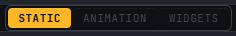

The editor has three scene modes, toggled via the tabs in the top toolbar:

| Mode | Purpose |
|---|---|
| **static** | Edit regular layers and elements (shapes, text, bitmaps) — the default mode |
| **animation** | Create and edit frame-by-frame animations for the current screen |
| **widgets** | Add and configure procedural widgets (clocks, gauges, etc.) for the current screen |

Each screen maintains its own independent set of layers, animations, and widgets.

---

### Multi-Screen Manager

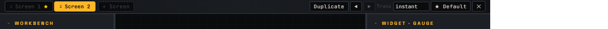

The screen tab bar sits below the top toolbar and lets you manage multiple independent screens in a single project.

| Control | Action |
|---|---|
| **Screen tabs** | Click to switch screens. Double-click the name to rename. |
| **`+ Screen`** | Add a new empty screen |
| **`Duplicate`** | Clone the current screen with all its layers, animations, and widgets |
| **`◀` / `▶`** | Reorder screens left / right |
| **`Trans` dropdown** | Set the transition animation when navigating **into** this screen |
| **`★ Default`** | Set this screen as the boot screen (shown on startup) |
| **`✕`** | Delete this screen (at least one screen must remain) |

The ★ badge on a tab indicates the default boot screen. Each screen has its own layers, animations, widgets, and erased-pixel mask.

---

### Workbench Panel

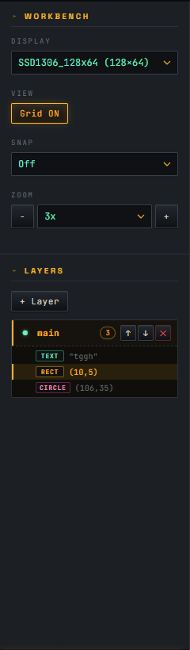

The left panel has two sections:

**Workbench** — global canvas settings:
- **Display** — choose your OLED hardware model
- **View** — toggle the pixel grid overlay
- **Snap** — enable snap-to-grid (Off / 1 / 2 / 4 / 8 / 16 px)
- **Zoom** — set zoom level (1× – 20×) or use `−` / `+` buttons

**Layers** — manage layers (see [Layers](#layers) section).

---

### Canvas

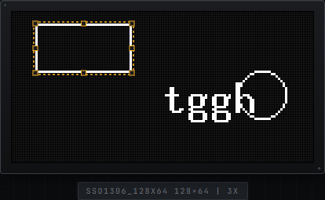

The canvas is a 1-bit pixel-accurate preview of your OLED display. It renders:
- White pixels on a black background — exactly matching the physical display
- An optional **pixel grid** overlay (toggle with the *View* button)
- An **orange dashed selection box** around the selected element
- A **status bar** at the bottom showing the display model, resolution, and current zoom level

Pan by scrolling. Zoom with `−` / `+` or the zoom dropdown.

---

### Layers Panel

The layers panel (bottom of the left sidebar) lists all layers and their elements.

- **`+ Layer`** — add a new layer
- **`●`** — toggle layer visibility (click the coloured dot)
- **Double-click** a layer name to rename it
- **`↑` / `↓`** — reorder layers
- **`✕`** — delete a layer (disabled if only one layer remains)
- Each layer shows all its elements as a clickable sub-list
- Elements show their type tag (`TEXT`, `RECT`, `CIRCLE`, etc.) and a summary (text content or coordinates)

---

### Properties Panel

The Properties panel (right side) shows editable properties for the currently selected element.

**Text element:**

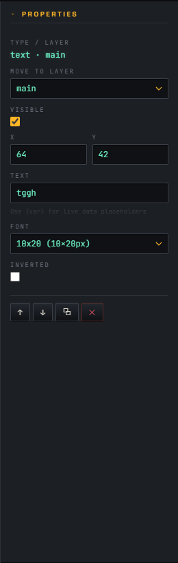

- X, Y position
- Text content (supports `{var}` placeholders for live data)
- Font selection (6 U8g2 fonts)
- Inverted toggle (renders text dark-on-light)
- Move-to-layer, Duplicate, Delete

**Rectangle / Circle element:**

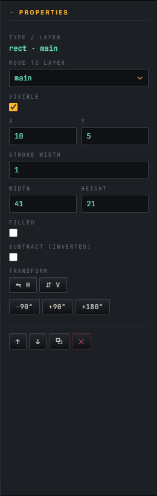

- X, Y, Width / Height (or Radius for circles)
- Stroke Width
- **Filled** checkbox
- **Subtract (Inverted)** checkbox — shape erases pixels instead of drawing them
- **Transform** — flip H/V, rotate −90° / +90° / +180°
- Move-to-layer, Duplicate, Delete, reorder Z-order

---

### Code Panel

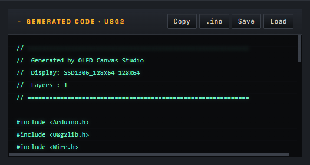

The code panel at the bottom displays the **live-generated U8g2 Arduino sketch**. It updates in real time as you draw.

**Buttons:**
| Button | Action |
|---|---|
| **Copy** | Copy the full sketch to the clipboard |
| **.ino** | Download as `layout.ino` Arduino file |
| **Save** | Save the project state as a `.json` file |
| **Load** | Load a previously saved `.json` project |

The generated code includes:
- `#include` statements for `Arduino.h`, `U8g2lib.h`, and `Wire.h`
- The correct U8G2 display constructor for your chosen display
- One `void draw<LayerName>()` function per layer, per screen
- A `drawScreen_<name>()` function per screen that orchestrates its layers, animations, and widgets
- A **screen navigation API**: `goToScreen(idx)`, `nextScreen()`, `prevScreen()`
- Transition runtime code for all 8 animated transition effects
- Animation playback logic using `millis()`-based frame timing
- Procedural widget drawing functions with live data binding
- Boilerplate `setup()` and `loop()` functions

---

## Drawing Tools

### Select (`V`)
Click to select any element. Selected elements show an orange dashed bounding box. Drag to move elements. When an element is selected, its properties appear in the right panel.

### Text (`T`)
Click anywhere on the canvas to place a text element. Edit the content and font in the Properties panel. Supports all 6 U8g2 fonts rendered pixel-accurately.

### Rectangle (`R`)
Click and drag to draw a rectangle. **Hold Shift** to constrain to a square. Set Filled or Stroke-only in the Properties panel.

### Circle (`C`)
Click and drag from the center outward. **Hold Shift** to constrain the bounding box to a square. The radius is the distance from the center to the cursor.

### Line (`L`)
Click and drag to draw a line segment. **Hold Shift** to snap the angle to 45° increments.

### Freehand Draw (`D`)
Click and drag to paint individual pixels directly onto the canvas. Creates a `pixels` element that accumulates all painted pixels.

### Eraser (`E`)
Click and drag to erase pixels. The eraser works non-destructively — erased pixels are tracked per layer and subtracted at render time.

### Import Bitmap (`I`)
Import a monochrome bitmap image onto the canvas as a `bitmap` element.

---

## Frame-by-Frame Animations

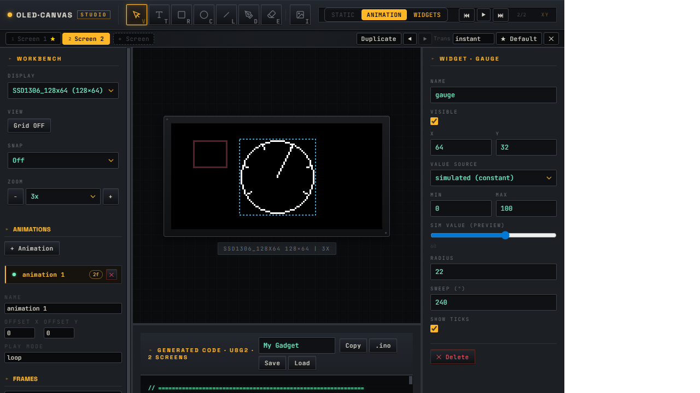

Switch to the **animation** scene mode to create sprite-style frame-by-frame animations. Each animation is composed of multiple frames, and each frame can contain any standard drawing elements (shapes, text, bitmaps, pixels).

### Creating an animation

1. Click the **animation** tab in the top toolbar
2. Click **+ Animation** in the left panel to create a new animation
3. Draw elements on the canvas — they belong to the currently selected frame
4. Click **+ Frame** to add more frames and draw different content on each

### Animation controls

| Control | Description |
|---|---|
| **Name** | Rename the animation |
| **Offset X / Y** | Position offset applied to the entire animation on screen |
| **Play mode** | `loop` (repeat forever), `once` (stop on last frame), or `ping-pong` (forward then backward) |
| **Frame strip** | Visual list of all frames showing index, element count, and duration |
| **Frame duration** | Per-frame display time in milliseconds (minimum 16 ms) |
| **`+ Frame`** | Add a new empty frame |
| **`Duplicate`** | Clone the current frame with all its elements |
| **`Delete`** | Remove the current frame (at least one must remain) |
| **`←` / `→`** | Reorder frames |

### Playback

When in animation mode, the top toolbar shows playback controls:
- **`▶`** — play / pause the animation
- **`⏮` / `⏭`** — step to previous / next frame
- **Frame counter** — shows current frame number (e.g. `2/5`)

### Onion skin

The **Onion Skin** section lets you preview adjacent frames as a translucent overlay while editing:
- **Prev** — show the previous frame
- **Next** — show the next frame
- **Opacity** — adjust overlay transparency (0 – 100%)

### Generated code

Each animation is rasterized to per-frame bitmaps stored as `PROGMEM` arrays. The generated `drawAnim_<id>()` function uses `millis()` to automatically advance frames at runtime, respecting the selected play mode.

---

## Procedural Widgets

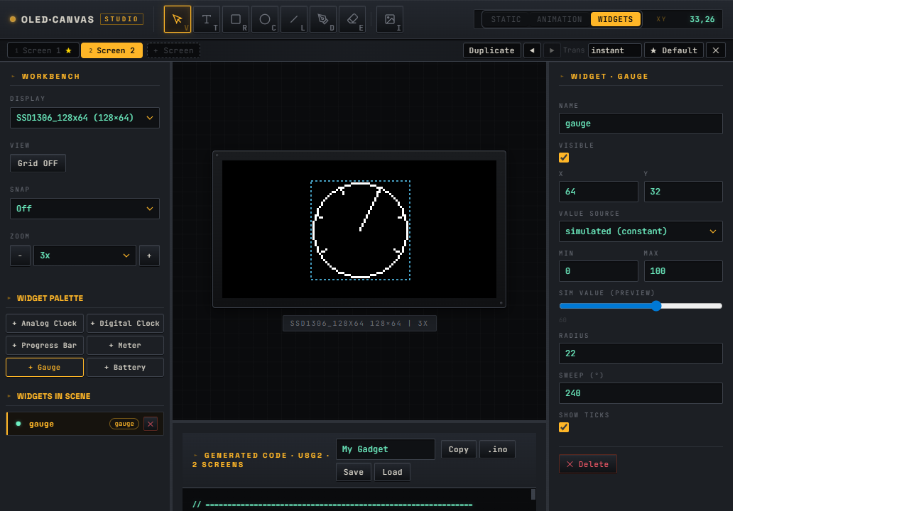

Switch to the **widgets** scene mode to add runtime-rendered UI components that display live data. Unlike static shapes, widgets generate procedural C drawing code — they are not rasterized bitmaps.

### Adding a widget

1. Click the **widgets** tab in the top toolbar
2. Click one of the 6 widget buttons in the **Widget Palette** to add it to the canvas
3. Select a widget in the **Widgets in scene** list to edit its properties in the right panel

### Widget types

| Widget | Description |
|---|---|
| **Analog Clock** | Circle with hour/minute/second hands. Configurable: radius, tick marks, second hand |
| **Digital Clock** | Time displayed as text. Configurable: format string (`HH:MM:SS`), font |
| **Progress Bar** | Rectangular bar that fills based on a value. Configurable: width, height, horizontal or vertical orientation |
| **Meter** | Segmented bar with configurable number of segments (2–32) |
| **Gauge** | Circular dial with a needle. Configurable: radius, sweep angle (30°–360°), tick marks |
| **Battery** | Battery-shaped icon with fill level |

### Data binding

Each widget has a **Value source** that determines where it gets its runtime value:

| Source | Behaviour |
|---|---|
| **sim** | Uses a constant simulated value — useful for previewing the widget in the editor |
| **time** | Reads the current time (seconds since midnight via `millis()`) |
| **variable** | References a named C variable from your user code (e.g. `sensorValue`) |

All widgets also have **min** / **max** fields to define the value range, and a **Sim value** slider for live preview in the editor.

### Generated code

Each visible widget generates a `drawWidget_<id>()` function that computes the normalized value and draws using U8g2 primitives (circles, lines, boxes, text). When the value source is `variable`, the generated code references your C variable directly.

---

## Screen Transitions

When using multiple screens, each screen can specify a **transition animation** that plays when navigating **into** that screen. Set it via the **Trans** dropdown in the screen manager bar.

| Transition | Effect |
|---|---|
| `instant` | No animation — immediate cut |
| `slideLeft` | Previous screen slides off left, next slides in from right |
| `slideRight` | Previous screen slides off right, next slides in from left |
| `slideUp` | Previous screen slides off top, next slides in from bottom |
| `slideDown` | Previous screen slides off bottom, next slides in from top |
| `wipeLeft` | Vertical wipe from left to right |
| `wipeRight` | Vertical wipe from right to left |
| `fade` | Checkerboard fade pattern |

The generated code includes a complete transition runtime and a navigation API:

```cpp
goToScreen(uint8_t idx);  // Navigate to screen by index (plays transition)
nextScreen();              // Go to next screen (wraps around)
prevScreen();              // Go to previous screen (wraps around)
```

You can call these from a `readScreenInput()` weak hook that the generated code provides for you to wire up button/input handling.

---

## Fonts

OLED Canvas Studio includes pixel-accurate glyph data for all supported U8g2 fonts, parsed from the official BDF font files:

| Label | U8g2 Font | Size |
|---|---|---|
| 5×7 | `u8g2_font_5x7_tr` | 5×7 px |
| 6×10 | `u8g2_font_6x10_tr` | 6×10 px |
| 7×13 | `u8g2_font_7x13_tr` | 7×13 px |
| 8×13 | `u8g2_font_8x13_tr` | 8×13 px |
| 9×15 | `u8g2_font_9x15_tr` | 9×15 px |
| 10×20 | `u8g2_font_10x20_tr` | 10×20 px |

Every font is rendered identically to what U8g2 draws on the physical display. The canvas preview is **not** an approximation — it uses the same glyph bitmaps.

**Live data placeholders:** Use `{variableName}` in a text element (e.g. `Temp: {temp}°C`) to mark where runtime data will appear. The placeholder is rendered as-is on the canvas and in the generated code as a comment marker.

---

## Subtract (Inverted) Mode

Any shape element (rectangle, circle, line) can be set to **Subtract** mode via the *Subtract (Inverted)* checkbox in the Properties panel. When enabled:

- The shape **erases** pixels from the display buffer instead of drawing them.
- This is useful for **cutout effects** — for example, drawing a filled rectangle and then punching a circle out of it.
- In the generated code, subtract shapes are wrapped with `u8g2.setDrawColor(0)` … `u8g2.setDrawColor(1)` to achieve the same effect on hardware.

---

## Layers

Layers let you separate elements into independently togglable groups, which is useful for:

- Turning off a background layer during layout work
- Generating partial draw functions (one per layer in the output code)
- Organising complex UIs (e.g. *background*, *widgets*, *overlay*)

Each layer generates its own `void draw<Name>()` function in the Arduino sketch. Layers are rendered in order (first layer = bottom of the stack).

---

## Display Presets

| Preset | Resolution | Controller |
|---|---|---|
| SSD1306_128x64 | 128×64 | SSD1306 |
| SSD1306_128x32 | 128×32 | SSD1306 |
| SH1106_128x64 | 128×64 | SH1106 |
| SSD1309_128x64 | 128×64 | SSD1309 |
| SSD1306_64x48 | 64×48 | SSD1306 |
| SSD1306_72x40 | 72×40 | SSD1306 |
| SH1107_128x128 | 128×128 | SH1107 |
| SH1107_64x128 | 64×128 | SH1107 |

Changing the display preset updates the canvas dimensions and the U8G2 constructor in the generated code.

---

## Project Save / Load

Projects are saved as plain `.json` files containing all screens, layers, elements, animations, widgets, display config, and erased pixels. Use the **Save** and **Load** buttons in the Code panel. Projects are portable and can be committed to version control alongside your Arduino sketch.

Loading is backward-compatible: older single-screen project files are automatically upgraded to the multi-screen format.

---

## Tech Stack

| Technology | Role |
|---|---|
| [React 19](https://react.dev/) | UI framework |
| [TypeScript](https://www.typescriptlang.org/) | Type safety |
| [Vite](https://vitejs.dev/) | Dev server & bundler |
| Custom pixel engine | 1-bit Bresenham line/circle renderer, mid-point algorithm |
| U8g2 BDF fonts | Pixel-accurate glyph data parsed from official font files |

---

## License

ISC — see [LICENSE](LICENSE).
